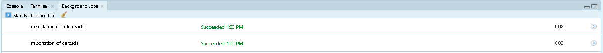

<!-- README.md is generated from README.Rmd. Please edit that file -->

```{r, include = FALSE}
knitr::opts_chunk$set(
  collapse = TRUE,
  comment = "#>",
  fig.path = "man/figures/README-",
  out.width = "100%", 
  warning = FALSE
)
```

```{r}
library(magrittr)
```


# The industtry package - a toolkit for structured datasets exploitation

<!-- badges: start -->
[](https://app.codecov.io/gh/danielrak/industtry?branch=master)
[](https://github.com/danielrak/industtry/actions/workflows/R-CMD-check.yaml)
<!-- badges: end -->

This package proposes a set of functions that helps exploiting structured datasets (mostly data frames) with an industrialization approach. Industrialization here means applying as efficiently as possible the same procedure to any number of inputs as long as these inputs have an identified common structure. This idea would have been very difficult to implement without the `purrr::` and `rio::` packages:

```{r}
purrr:::map(c("purrr", "rio"), citation) %>% print(style = "text")
```


**It's best to use it with RStudio.**

Its contribution is probably in the idea of applying transformations to the set level (of any number of data frames, for e.g), given that numerous existing package help the user exploit one dataset at a time. The functions of this package that are the most in line with this philosophy are: `convert_r()`, `inspect_vars()`, `serial_import()` and `parallel_import()`. 

This package also provides a set of micro-tools for dealing with usual data transformation tasks, particularly with R/RStudio.

## Installation

You can install the development version of industtry from [GitHub](https://github.com/) with:

``` r
# install.packages("devtools")
devtools::install_github("danielrak/industtry")
```

## Example 1 - importations

```{r}
library(industtry)
```
  
Most of (but not all) use cases of data exploitation begins with datasets importation. When you have to work in some way with several datasets simultaneously, it may be useful to be able to import these with a simple code. That is the purpose of the two functions `serial_import()` and `parallel_import()`.
  
Suppose you begin with an empty working session:   
  
```{r}
ls()
```

Say you want to import two data frames: cars.rds and mtcars.rds stored somewhere accessible to you: 

```{r}
yourdir <- system.file("permadir_examples_and_tests/importations", package = "industtry")

list.files(yourdir) %>% purrr::keep(stringr::str_detect(., "\\.rds$"))
```

Note that as long as you have the resources (storage and memory), the procedure is the same for 2, 20, 200, ... data frames. 
  
Prepare a vector of paths of data frames you want to import: 

```{r}
lfiles <- list.files(yourdir, full.names = TRUE) %>% 
  purrr::keep(stringr::str_detect(., "\\.rds"))
```

One by one importation:
  
```{r}
serial_import(lfiles)

ls()
```

You should have correctly imported the data: 
  
```{r}
list("cars" = head(cars.rds), 
     "mtcars" = head(mtcars.rds))
```
  
If you want to be able to still use the Console while importing or to avoid interrupting all of the process after one failure: 
    
```{r}
# Remove from working session to illustrate parallel_import(): 
rm(cars.rds, mtcars.rds)
```
     
```{r, eval = FALSE}
parallel_import(lfiles)
```
    
This is what you should observe: 


